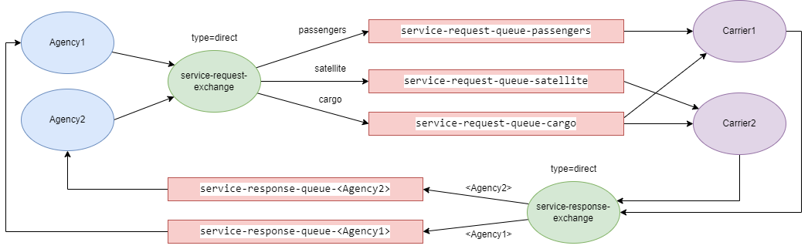

# SpaceMarket

## Uruchomienie
### Agencja
`./run_agency.sh "<agency_name>"`
### Przewoźnik
`./run_carrier.sh "<offered_service1> <offered_service2>"`
\
Można również skorzystać z dostarczonych skryptów.

## Interakcja
### Agencja
* `quit` - wyjście
* `help` - wyświetla listę usług, o których wykonanie można prosić przewoźników
* `<service_name>` - wysyła prośbę wykonania usługi

### Przewoźnik
* `quit` - wyjście

## Diagram reprezentujący scenariusz opisany w treści zadania

